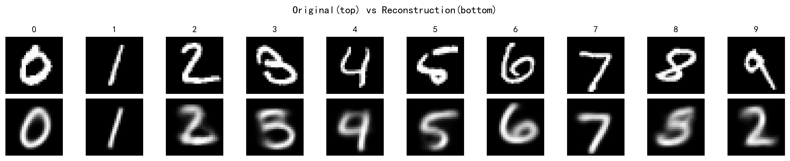
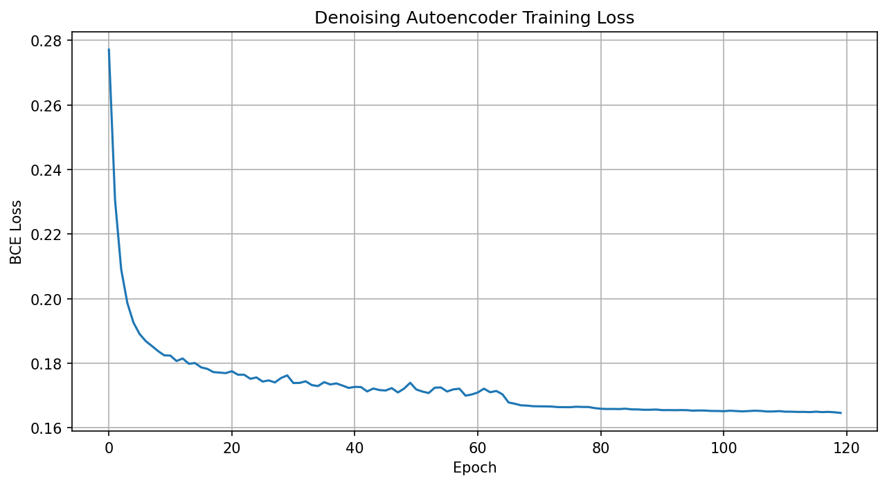
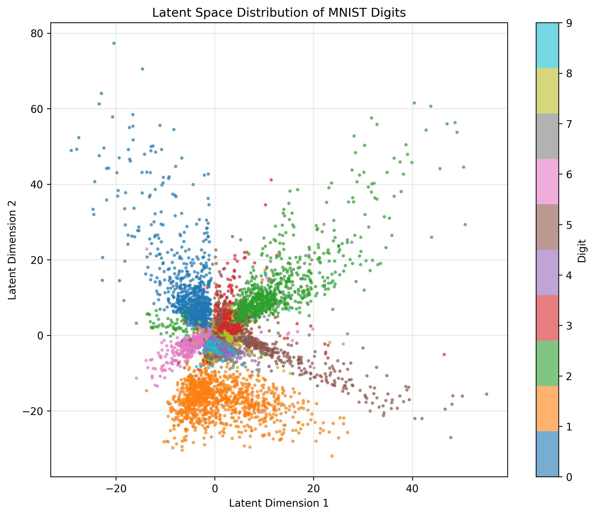
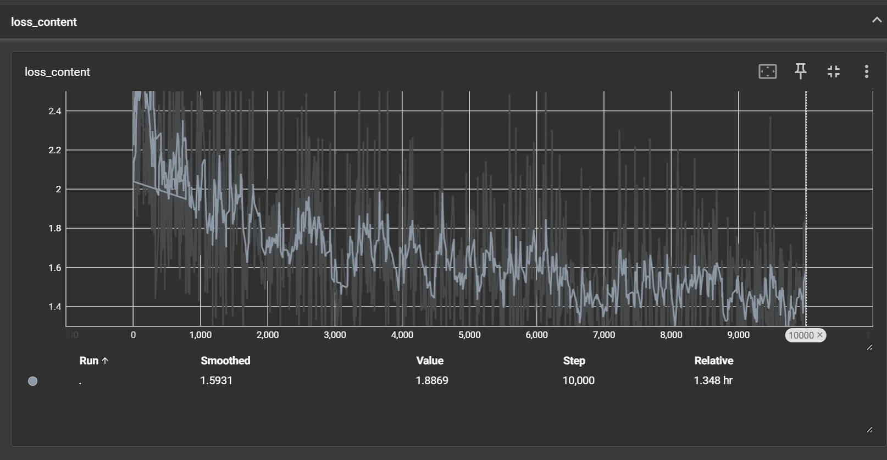
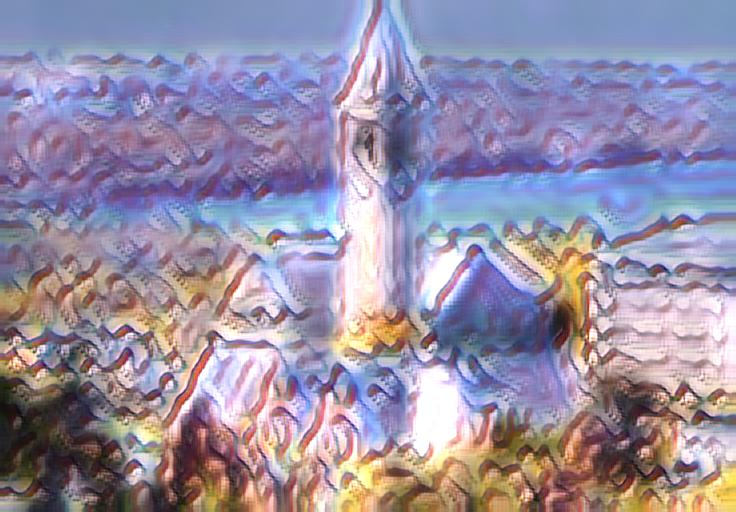

# 《神经网络与深度学习》课程实验作业（三）

注意事项：

①  本次实验包含两道题，共计30分；

②  所有实验结果需以实验报告的形式进行提交，文件命名格式：实验三_姓名_学号.docx，文件中需要将作者设置为本人姓名；

③  实验报告中需要插入代码片段，完整代码无需放在实验报告中，以压缩包的形式添加即可，压缩包命名格式：实验三_姓名_学号.zip；

④  作业提交截止时间：2025年12月31日晚上23：59

**基于MNIST数据集的自编码器实现(15分)**

MNIST 数据集来自美国国家标准与技术研究所, National Institute of Standards and Technology (NIST). 训练集 (training set) 由来自 250 个不同人手写的数字构成。请基于该数据集，并结合所学知识完成以下实验内容：

(1)   完成数据读写并试着**搭建深度自编码器网络**。使用 print 打印网络结构并将结果截图放入实验报告中。(1分)

(2)   选择二元交叉熵函数作为损失函数，在**限制 bottleneck 层维度为2的情况下训练模型**。给出相应代码截图，并给出数字从0到9的10张图片的原始图片和重建图片。(3分)

(3)   设置**噪声因子为 0.4**，在输入图像上叠加均值为0且方差为1的标准高斯白噪声，**训练降噪自编码器** ，给出相应的代码截图和关键部分代码说明 (4分)，并进行降噪结果展示，给出数字从0到9的10张图片的原始图片、加噪图片和重建图片。(3分)。

代码示例：

```
noise_factor = 0.4
x_train_noisy = x_train + noise_factor * np.random.normal(loc=0.0, scale=1.0, size=x_train.shape)
```

(4)   试在问题(2)的基础上，对 latent code 进行均匀采样，并利用解码器对采样结果进行恢复，展示 latent code 的分布、采样范围和采样结果，观察并描述所得到的结果。(4分)

MNIST 数据集下载：http://yann.lecun.com/exdb/mnist/

**图像风格迁移（15分）**

图像风格迁移任务是将一幅图像的风格应用到另一幅图像的内容上，从而生成具有目标风格特征的新图像。在过去的探索中，人们发现图像风格与 latent code 的统计特性高度相关，修改 latent code 的统计特性可以实现风格迁移。一种简单但高效的方法是基于Instance Normalization(IN)实现，在下图中体现为 AdaIN 模块。AdaIN 模块同时接收 content 的 latent code $x$ 和style的 latent code $y$，然后基于下述公式对齐均值和方差：
$$
AdaIN(x,y) = \sigma(y)(\frac{x - \mu(x)}{\sigma(x)})
$$
对 latent code 的统计特性进行修改后，将其结果输入给 decoder，即可重建出风格迁移后的图像。后续问题是如何在没有风格迁移结果的条件下进行自监督学习？

答案是再经过一遍编码器，用 latent code 构建自监督学习。记 content 图像为 $c$，style 图像为 $s$，预训练的VGG Encoder 为$f$ ，则风格迁移后的 latent code 为 $t = AdaIN(f(c),f(s))$。使用一个随机初始化的 Decoder $g$ 将 latent code 映射为图像，生成的风格迁移图像 $T(c,s) = g(t)$。

MS-COCO (Microsoft Common Objects in Context) 是一个广泛应用于计算机视觉的目标检测数据集，本次实验选取其中的 train2014 作为 content 图像的训练集。WikiArt 数据集是 kaggle 上开源数据集，用于 style 图像的训练集。每个数据集大约包含 80,000 张图像。试基于上述两个数据集，完成以下实验内容：

(1)   基于开源项目 https://github.com/naoto0804/pytorch-AdaIN.git 训练自己的风格迁移模型，使用tensorboard可视化训练过程，请将训练过程的结果放入实验报告中。（(1)和(2)总共只需训练一次，但注意保存训练过程中不同阶段的模型）（2分）

(2)   训练模型的超参数可自行调整，但总迭代次数不得少于10000次。给出迭代次数分别达到总迭代次数的10%、50%、 80%和100%时的风格迁移图像结果。具体要求是，content 图片使用(1)中开源项目的 input/content/cornell.jpg，style 图片使用(1)中开源项目的 input/style/woman_with_hat_matisse.jpg。（4分）

(3)   请大家任选北邮的2个特色景点，分别拍取自己和北邮景点的合照，得到两张不同景点的图像。选取一种风格，对两张图像进行风格迁移，展示输入的 content 图像和 style 图像以及输出的风格迁移图像。（6分）

(4)   任意选取上述(3)中一张合照，并使用和(3)中不同的图像风格，赋予AdaIN的输出权重 $\alpha$，并赋予 content 图像通过VGG Encoder后的输出权重 $1- \alpha$。对二者加权求和后送入 decoder，设置不同 $\alpha$，展示 style 不同占比情况下的风格迁移结果。学号尾号为偶数的同学 $\alpha$ 分别设置为0.3，0.6，0.9, 学号尾号为奇数的同学 $\alpha$分别设置为0.2，0.5，0.8。（3分）

---

# 基于MNIST数据集的自编码器实现

MNIST 数据集来自美国国家标准与技术研究所, National Institute of Standards and Technology (NIST). 训练集 (training set) 由来自 250 个不同人手写的数字构成。请基于该数据集，并结合所学知识完成以下实验内容：

(1)   完成数据读写并试着**搭建深度自编码器网络**。使用 print 打印网络结构并将结果截图放入实验报告中。(1分)

(2)   选择二元交叉熵函数作为损失函数，在**限制 bottleneck 层维度为2的情况下训练模型**。给出相应代码截图，并给出数字从0到9的10张图片的原始图片和重建图片。(3分)

(3)   设置**噪声因子为 0.4**，在输入图像上叠加均值为0且方差为1的标准高斯白噪声，**训练降噪自编码器** ，给出相应的代码截图和关键部分代码说明 (4分)，并进行降噪结果展示，给出数字从0到9的10张图片的原始图片、加噪图片和重建图片。(3分)。

(4)   试在问题(2)的基础上，对 latent code 进行均匀采样，并利用解码器对采样结果进行恢复，展示 latent code 的分布、采样范围和采样结果，观察并描述所得到的结果。(4分)

## 代码结构

```python
📦self_encoding
 ┣ 📂dataset
 ┣ 📂results
 ┃ ┣ 📜autoencoder.pth # 深度自编码器模型输出
 ┃ ┣ 📜denoise_autoencoder.pth # 降噪自编码器模型输出
 ┃ ┣ 📜denoise_loss_curve.png 
 ┃ ┣ 📜denoising_result.png # 降噪重构结果
 ┃ ┣ 📜latent_distribution.png # 任务四二维聚类图
 ┃ ┣ 📜latent_sampling.png # 任务四预测图
 ┃ ┣ 📜loss_curve.png # SAE 训练损失曲线
 ┃ ┗ 📜reconstruction.png # SAE重建图片
 ┣ 📜dataloader.py
 ┣ 📜data_download.py
 ┣ 📜denoise_train.py 
 ┣ 📜model.py # SAE 模型结构
 ┣ 📜train.py
 ┗ 📜visualize_latent.py
```


## 1. 完成数据读写并试着搭建深度自编码器网络

### 1.1. 从kaggle上下载数据

```python
import kagglehub

# Download latest version
path = kagglehub.dataset_download("hojjatk/mnist-dataset")

print("Path to dataset files:", path)
```

### 1.2. 搭建自编码器网络

根据文章：https://zhuanlan.zhihu.com/p/133207206中对自编码器的介绍：可知自编码器的本质是"模仿"，通过重建原图片，实现非线性变换的降维，而不是像 PCA 一样的线性降维，进而拥有更好地拟合能力。

**为获得更好的拟合效果**，此处采用栈式自编码器 SAE，网络结构如下：

```bash
模型结构:
AutoEncoder(
  (encoder): Sequential(
    (0): Flatten(start_dim=1, end_dim=-1)
    (1): Linear(in_features=784, out_features=512, bias=True)
    (2): LeakyReLU(negative_slope=0.02)
    (3): Linear(in_features=512, out_features=128, bias=True)
    (4): LeakyReLU(negative_slope=0.02)
    (5): Linear(in_features=128, out_features=64, bias=True)
    (6): LeakyReLU(negative_slope=0.02)
    (7): Linear(in_features=64, out_features=10, bias=True)
    (8): LeakyReLU(negative_slope=0.02)
    (9): Linear(in_features=10, out_features=2, bias=True)
  )
  (decoder): Sequential(
    (0): Linear(in_features=2, out_features=10, bias=True)
    (1): LeakyReLU(negative_slope=0.02)
    (2): Linear(in_features=10, out_features=64, bias=True)
    (3): LeakyReLU(negative_slope=0.02)
    (4): Linear(in_features=64, out_features=128, bias=True)
    (5): LeakyReLU(negative_slope=0.02)
    (6): Linear(in_features=128, out_features=512, bias=True)
    (7): LeakyReLU(negative_slope=0.02)
    (8): Linear(in_features=512, out_features=784, bias=True)
    (9): Sigmoid()
  )
)
```




```mermaid
graph TD
    %% 定义样式
    classDef input fill:#e1f5fe,stroke:#01579b,stroke-width:2px,rx:5,ry:5;
    classDef layer fill:#fff9c4,stroke:#fbc02d,stroke-width:1px;
    classDef act fill:#f3e5f5,stroke:#7b1fa2,stroke-width:1px,stroke-dasharray: 5 5;
    classDef bottleneck fill:#ffcc80,stroke:#e65100,stroke-width:4px,rx:10,ry:10;
    classDef output fill:#ccff90,stroke:#33691e,stroke-width:2px,rx:5,ry:5;
    classDef group style fill:#f5f5f5,stroke:#999,stroke-width:2px,stroke-dasharray: 5 5;

    %% 输入层
    Input([Input Image<br/>1x28x28]):::input
    
    %% 编码器部分
    subgraph Encoder_Block [Encoder]
        direction TB
        Flatten[Flatten<br/>28x28 -> 784]:::layer
        
        E_L1[Linear<br/>784 -> 512]:::layer
        E_A1(LeakyReLU):::act
        
        E_L2[Linear<br/>512 -> 128]:::layer
        E_A2(LeakyReLU):::act
        
        E_L3[Linear<br/>128 -> 64]:::layer
        E_A3(LeakyReLU):::act
        
        E_L4[Linear<br/>64 -> 10]:::layer
        E_A4(LeakyReLU):::act
        
        E_L5[Linear<br/>10 -> 2]:::layer
    end

    %% 瓶颈层
    Bottleneck((Latent Code<br/>dim=2)):::bottleneck

    %% 解码器部分
    subgraph Decoder_Block [Decoder]
        direction TB
        D_L1[Linear<br/>2 -> 10]:::layer
        D_A1(LeakyReLU):::act
        
        D_L2[Linear<br/>10 -> 64]:::layer
        D_A2(LeakyReLU):::act
        
        D_L3[Linear<br/>64 -> 128]:::layer
        D_A3(LeakyReLU):::act
        
        D_L4[Linear<br/>128 -> 512]:::layer
        D_A4(LeakyReLU):::act
        
        D_L5[Linear<br/>512 -> 784]:::layer
        D_Sig(Sigmoid):::act
    end

    %% 输出层
    Reshape[Reshape<br/>784 -> 1x28x28]:::layer
    Output([Reconstructed Image<br/>1x28x28]):::output

    %% 连接关系
    Input --> Flatten
    Flatten --> E_L1 --> E_A1
    E_A1 --> E_L2 --> E_A2
    E_A2 --> E_L3 --> E_A3
    E_A3 --> E_L4 --> E_A4
    E_A4 --> E_L5
    
    E_L5 --> Bottleneck
    
    Bottleneck --> D_L1 --> D_A1
    D_A1 --> D_L2 --> D_A2
    D_A2 --> D_L3 --> D_A3
    D_A3 --> D_L4 --> D_A4
    D_A4 --> D_L5 --> D_Sig
    
    D_Sig --> Reshape --> Output
```

### 1.3. 编写数据加载器脚本

```python
class MNISTDataset(Dataset):
    """自定义MNIST数据集加载器，从idx文件读取"""
    def __init__(self, data_dir, train=True, transform=None):
        """
        Args:
            data_dir: 数据集目录路径
            train: True加载训练集，False加载测试集
            transform: 可选的数据变换
        """
def get_dataloader(data_dir, batch_size=256, train=True, shuffle=True, num_workers=4):
    """
    获取MNIST数据加载器
    Args:
        data_dir: 数据集目录
        batch_size: 批次大小
        train: 是否为训练集
        shuffle: 是否打乱数据
        num_workers: 数据加载线程数

    Returns:
        DataLoader对象
    """
def get_samples(data_dir, train=False):
    """
    获取每个数字(0-9)的一个样本
    Args:
        data_dir: 数据集目录
        train: 是否从训练集获取

    Returns:
        images: shape (10, 1, 28, 28) 的tensor
        labels: 0-9的标签列表
    """
```

## 2. 模型训练

对 SAE 进行训练，由于是无监督学习，因此不需要使用图片标签进行训练。

**深度自编码器训练**

```python
 # main函数中
    batch_size = 256
    learning_rate = 1e-3
    epochs = 100
    data_dir = './dataset'
    save_path = './results'
    device = torch.device('cuda' if torch.cuda.is_available() else 'cpu')
    print(f"使用设备: {device}")

    train_loader = get_dataloader(data_dir, batch_size=batch_size, train=True)
    print(f"训练集大小: {len(train_loader.dataset)}")

    model = AutoEncoder().to(device)
    print("\n模型结构:")
    print(model)

    loss_fn = nn.BCELoss()
    optimizer = optim.Adam(model.parameters(), lr=learning_rate)
    scheduler = torch.optim.lr_scheduler.ReduceLROnPlateau(optimizer, mode='min', factor=0.1, patience=5)

    print("\n开始训练...")
    loss_history = train(model, train_loader, loss_fn, optimizer, scheduler,device, epochs)

    # 保存模型
    os.makedirs(save_path, exist_ok=True)
    model_path = os.path.join(save_path, 'autoencoder.pth')
    torch.save(model.state_dict(), model_path)
    print(f"\n模型已保存到 {model_path}")

    # 可视化结果
    plot_loss(loss_history, save_path)
    visualize_reconstruction(model, data_dir, device, save_path)
```

**训练过程**：

```bash
开始训练...
Epoch [10/100], Loss: 0.175239, Learning Rate: 0.001000
Epoch [20/100], Loss: 0.170615, Learning Rate: 0.001000
Epoch [30/100], Loss: 0.166886, Learning Rate: 0.001000
Epoch [40/100], Loss: 0.165478, Learning Rate: 0.001000
Epoch [50/100], Loss: 0.161814, Learning Rate: 0.000100
Epoch [60/100], Loss: 0.160716, Learning Rate: 0.000100
Epoch [70/100], Loss: 0.160104, Learning Rate: 0.000100
Epoch [80/100], Loss: 0.159168, Learning Rate: 0.000100
Epoch [90/100], Loss: 0.158734, Learning Rate: 0.000100
Epoch [100/100], Loss: 0.158320, Learning Rate: 0.000100

模型已保存到 ./results/autoencoder.pth
重建结果已保存到 ./results/reconstruction.png
```

**损失曲线**


**训练结果**



## 3. 降噪自编码器训练

```python
def main():
    # 超参数
    batch_size = 256
    learning_rate = 1e-3
    epochs = 120
    noise_factor = 0.4
    data_dir = './dataset'
    save_path = './results'

    device = torch.device('cuda' if torch.cuda.is_available() else 'cpu')
    print(f"使用设备: {device}")

    train_loader = get_dataloader(data_dir, batch_size=batch_size, train=True)
    print(f"训练集大小: {len(train_loader.dataset)}")

    model = AutoEncoder().to(device)
    print("\n模型结构:")
    print(model)

    loss_fn = nn.BCELoss()
    optimizer = optim.Adam(model.parameters(), lr=learning_rate)
    scheduler = torch.optim.lr_scheduler.ReduceLROnPlateau(optimizer, mode='min', factor=0.1, patience=5)

    # 训练
    print(f"\n开始训练降噪自编码器 (噪声因子: {noise_factor})...")
    loss_history = train_denoising(
        model=model,
        train_loader=train_loader,
        loss_fn=loss_fn,
        optimizer=optimizer,
        scheduler=scheduler,
        device=device,
        epochs=epochs,
        noise_factor=noise_factor)

    # 保存模型
    os.makedirs(save_path, exist_ok=True)
    model_path = os.path.join(save_path, 'denoise_autoencoder.pth')
    torch.save(model.state_dict(), model_path)
    print(f"\n模型已保存到 {model_path}")

    # 可视化结果
    plot_loss(loss_history, save_path)
    visualize_denoising(model, data_dir, device, noise_factor, save_path)
```

**训练过程**

```bash
开始训练降噪自编码器 (噪声因子: 0.4)...
Epoch [10/120], Loss: 0.182431, Learning Rate: 0.001000
Epoch [20/120], Loss: 0.176919, Learning Rate: 0.001000
Epoch [30/120], Loss: 0.176220, Learning Rate: 0.001000
Epoch [40/120], Loss: 0.172335, Learning Rate: 0.001000
Epoch [50/120], Loss: 0.173927, Learning Rate: 0.001000
Epoch [60/120], Loss: 0.170303, Learning Rate: 0.001000
Epoch [70/120], Loss: 0.166664, Learning Rate: 0.000100
Epoch [80/120], Loss: 0.166088, Learning Rate: 0.000100
Epoch [90/120], Loss: 0.165643, Learning Rate: 0.000100
Epoch [100/120], Loss: 0.165194, Learning Rate: 0.000100
Epoch [110/120], Loss: 0.165154, Learning Rate: 0.000100
Epoch [120/120], Loss: 0.164589, Learning Rate: 0.000100

模型已保存到 ./results/denoise_autoencoder.pth
损失曲线已保存到 ./results/denoise_loss_curve.png
降噪结果已保存到 ./results/denoising_result.png
```

**损失曲线**



**训练结果**


## 4. Latent Code 采样与可视化

对 latent code 进行均匀采样，并利用解码器对采样结果进行恢复：

1.  丢掉 Encode，只使用训练好的 Decoder
2.  构造 Latent Vector，在二维的 latent 空间分布上，使用两个维度的量程作为均匀采样的范围，采样数为20
3.  对采样值进行解码重建

```python
def main():
    data_dir = './dataset'
    save_path = './results'
    model_path = os.path.join(save_path, 'autoencoder.pth')
    n_samples = 20

    device = torch.device('cuda' if torch.cuda.is_available() else 'cpu')
    print(f"使用设备: {device}")

    model = AutoEncoder().to(device)
    if os.path.exists(model_path):
        model.load_state_dict(torch.load(model_path, map_location=device))
        print(f"已加载模型: {model_path}")
    else:
        print(f"Error: 找不到模型文件 {model_path}")
        print("请先运行 train.py 训练模型")
        return

    test_loader = get_dataloader(data_dir, batch_size=256, train=False, shuffle=False)
    print(f"测试集大小: {len(test_loader.dataset)}")

    print("\n1. 可视化Latent Space分布...")
    x_min, x_max, y_min, y_max = visualize_latent_distribution(model, test_loader, device, save_path)

    print(f"\n2. 在Latent Space中均匀采样 ({n_samples}x{n_samples})...")
    margin = 0.5
    sample_and_decode(
        model, device,
        x_range=(x_min - margin, x_max + margin),
        y_range=(y_min - margin, y_max + margin),
        n_samples=n_samples,
        save_path=save_path
    )
```

### 4.1. 所有测试数据在 latent space 中的分布




**结果分析**：

1. 数字0、1、2、5的簇相对独立，与其他数字较为分散。数字1和2的簇十分紧密。
2. 其他数字基本混叠在中心区域，除了数字6和3稍微分离一些。
3. 坐标轴范围为 [-30, 50], [-30, 80]，展示了这是个普通 AE，非 VAE 将分布约束为标准正态分布

### 4.2.采样重建结果


**结果分析**：

采样重建图验证了坐标与图像内容的对应关系。左侧坐标稳定生成0，证明了 Decoder 学习到了坐标到图像的映射规则。但是采样图中存在大量重复图像，说明潜在空间并非连续密布的，即存在空洞。模型在未见过的坐标点上的泛化能力主要表现为对最近邻样本的逼近。

---

# 图像风格迁移

(1)   基于开源项目 https://github.com/naoto0804/pytorch-AdaIN.git 训练自己的风格迁移模型，使用tensorboard可视化训练过程，请将训练过程的结果放入实验报告中。（(1)和(2)总共只需训练一次，但注意保存训练过程中不同阶段的模型）（2分）

(2)   训练模型的超参数可自行调整，但总迭代次数不得少于10000次。给出迭代次数分别达到总迭代次数的10%、50%、 80%和100%时的风格迁移图像结果。具体要求是，content 图片使用(1)中开源项目的 input/content/cornell.jpg，style 图片使用(1)中开源项目的 input/style/woman_with_hat_matisse.jpg。（4分）

(3)   请大家任选北邮的2个特色景点，分别拍取自己和北邮景点的合照，得到两张不同景点的图像。选取一种风格，对两张图像进行风格迁移，展示输入的 content 图像和 style 图像以及输出的风格迁移图像。（6分）

(4)   任意选取上述(3)中一张合照，并使用和(3)中不同的图像风格，赋予AdaIN的输出权重 $\alpha$，并赋予 content 图像通过VGG Encoder后的输出权重 $1- \alpha$。对二者加权求和后送入 decoder，设置不同 $\alpha$，展示 style 不同占比情况下的风格迁移结果。学号尾号为偶数的同学 $\alpha$ 分别设置为0.3，0.6，0.9, 学号尾号为奇数的同学 $\alpha$分别设置为0.2，0.5，0.8。（3分)

---

## 代码结构

```python
📦pytorch-AdaIN
 ┣ 📂dataset # 数据集
 ┃ ┣ 📂COCO
 ┃ ┗ 📂Wiki-art
 ┣ 📂experiments # decode模型持久化：epoch 1000, 5000, 8000, 10000
 ┣ 📂input
 ┃ ┣ 📂content
 ┃ ┃ ┣ 📜bupt1.jpg # 任务三图片一
 ┃ ┃ ┣ 📜bupt2.jpg # 人土三图片二
 ┣ 📂models
 ┣ 📂output # 任务三、四风格迁移的图片输出
 ┣ 📂output_iterations # 任务二的不同训练轮次的decode风格迁移图片输出
 ┣ 📂runs # Tensorboard 损失值曲线绘制
 ┣ 📜function.py
 ┣ 📜net.py
 ┣ 📜sampler.py
 ┣ 📜test.py
 ┣ 📜test_iterations.py # 测试不同迭代次数的模型效果
 ┣ 📜test_video.py
 ┣ 📜torch_to_pytorch.py
 ┗ 📜train.py
```


## 1. 复现和模型训练

> **AdaIN** 实现一个模型可训练多种风格的方法：
>
> 以前的方法训练一个网络只能迁移一种风格（例如梵高），换风格需要重新训练模型。而 AdaIN 提出一种办法：将风格定义为特征层的均值（Mean）和方差（Variance）：
>
> 1. 把内容图（Content）的特征均值方差抹去
> 2. 换上风格图（Style）的特征均值方差
> 3. 这样 Decoder 还原出来的就是内容图的骨架 + 风格图的皮
>
> 公式：
> $$
> AdaIN(x,y) = \sigma(y)(\frac{x - \mu(x)}{\sigma(x)}) + \mu(y)
> $$

在 `train.py` 中添加参数：

```python
parser.add_argument('--log_dir', default='./runs',
                    help='Directory to save the TensorBoard log')
```

在训练循环中添加：

```python
    writer.add_scalar('loss_content', loss_c.item(), i + 1)
    writer.add_scalar('loss_style', loss_s.item(), i + 1)
    writer.add_scalar('loss_total', loss.item(), i + 1)
```

将每一轮次的内容图的训练损失 `loss_c`、风格图的训练损失 `loss_s` 以及总的训练损失 `loss = c + s` 写入日志。

得到以下 loss 曲线图：

**总的训练损失**


**内容图训练损失**



**风格图训练损失**


---

## 2. 过程可视化

**模型训练指令**：

```bash
python train.py --content_dir dataset/coco --style_dir dataset/wikiart --max_iter 10000 --batch_size 8 __n_threads 8
```

模型的持久化：在 `./experiments` 下

- `decoder_iter_1000.pth.tar`
- `decoder_iter_5000.pth.tar`
- `decoder_iter_8000.pth.tar`
- `decoder_iter_10000.pth.tar`

执行脚本：

```bash
python test_iterations.py --max_iter 10000
```

>  `test_iterations.py` 专门用于生成不同迭代次数的风格迁移结果，结果输出到 `./output_iterations/` 目录

**结果展示**

**原内容图**：


**参考风格图**


**效果图**：

**迭代次数10%**



**迭代次数50%**


**迭代次数80%**


**迭代次数100%**


---

## 3.北邮特色景点打卡 

输入指令：

```bash
python test.py --content bupt1.jpg --style input/style/picasso_seated_nude_hr.jpg --decoder experiments/decoder_iter_10000.pth.tar
python test.py --content input/content/bupt2.jpg --style input/style/picasso_seated_nude_hr.jpg --decoder experiments/decoder_iter_10000.pth.tar
```

### 输入的 content 图像

**bupt1**


**bupt2**


---

### 输出的风格图

**bupt1素描**


**bupt2毕加索**


> 丑死我了

---

## 4. Alpha ($\alpha$) 权重控制

**学号尾数684，故 $\alpha$ 取值为 $0.3,0.6,0.9$**。

观察 `test.py` 中的 `style_transfer`，其已经实现题目的要求，只需要连续运行三次，指定不同的 $\alpha$ 即可。

```python
def style_transfer(vgg, decoder, content, style, alpha=1.0,
                   interpolation_weights=None):
    assert (0.0 <= alpha <= 1.0)
    # 将原图 content 和风格参考图 style 传入网络
    content_f = vgg(content)
    style_f = vgg(style)
    if interpolation_weights:
        _, C, H, W = content_f.size()
        feat = torch.FloatTensor(1, C, H, W).zero_().to(device)
        base_feat = adaptive_instance_normalization(content_f, style_f)
        for i, w in enumerate(interpolation_weights):
            feat = feat + w * base_feat[i:i + 1]
        content_f = content_f[0:1]

    else:
        feat = adaptive_instance_normalization(content_f, style_f)
    # 赋予AdaIN的输出权重 α, 并赋予 content 图像通过VGG Encoder后的输出权重 1-α
    # 已实现
    feat = feat * alpha + content_f * (1 - alpha)
    return decoder(feat)
```

执行指令：

使用 la_muse.jpg 作为风格画

```bash
python test.py --content input/content/bupt1.jpg --style input/style/la_muse.jpg --decoder experiments/decoder_iter_10000.pth.tar --alpha 0.3
python test.py --content input/content/bupt1.jpg --style input/style/la_muse.jpg --decoder experiments/decoder_iter_10000.pth.tar --alpha 0.6
python test.py --content input/content/bupt1.jpg --style input/style/la_muse.jpg --decoder experiments/decoder_iter_10000.pth.tar --alpha 0.9
```

### 风格图


---

### 输出

**权重=0.3**：


**权重=0.6**：


**权重=0.9**：


> （脑子里只有对分数的渴望，完全没有对美的追求）
