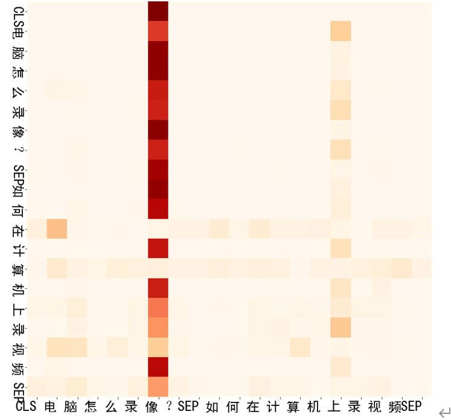
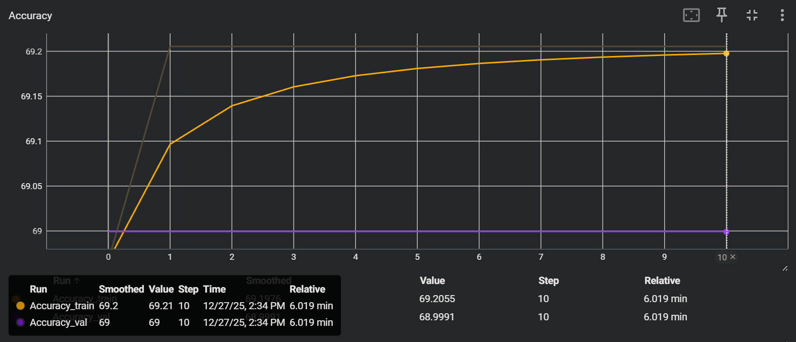
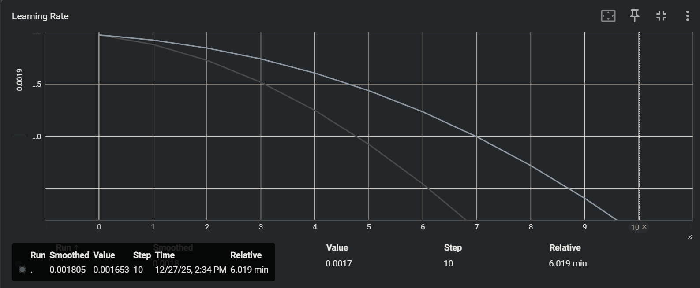
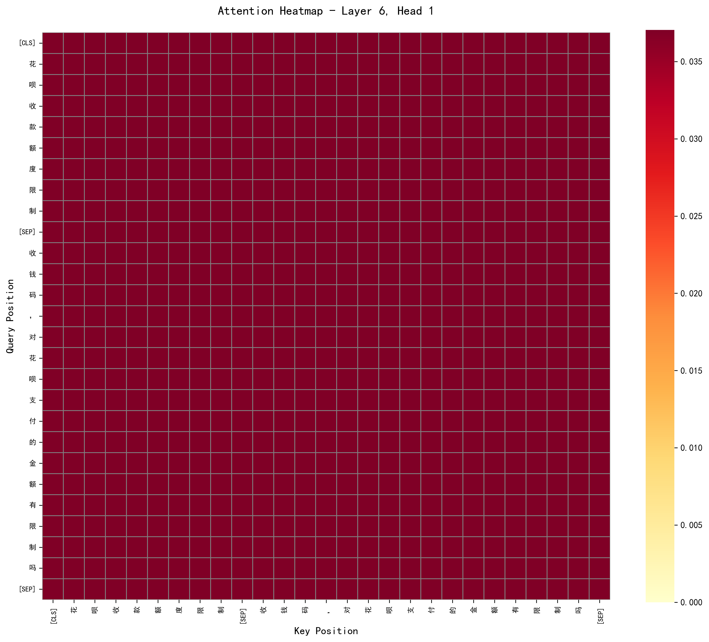

# 《神经网络与深度学习》课程实验作业（四）

**实验内容：自然语言处理**

注意事项：

①  本次实验包含一道题，共计30分；

②  所有实验结果需以实验报告的形式进行提交，文件命名格式：实验四_姓名_学号.pdf，文件中需要将作者设置为本人姓名；

③  实验报告中可插入代码片段，完整代码无需放在实验报告中，以压缩包的形式添加即可，压缩包命名格式：实验四_姓名_学号.zip；

④  作业提交截止时间：2025年12月31日晚上23：59

搭建Transformer编码器完成文本语义匹配任务(30分)

AFQMC数据集是一个蚂蚁金融语义相似度数据集，用于问题相似度计算，数据集包括训练集、验证集、测试集（无label，本实验不使用）3个文件，分别包含34334、4316以及3861条数据，每条数据有三个属性，分别是句子1、句子2、句子相似度标签。相似度标签为1表示两个句子含义类似，标签为0则表示含义不同。请基于该数据集完成以下实验内容：

(1)   数据集构建，包括：利用词表将句子中的每个中文字符转换成id、对不在词汇表里面的字做出适当处理、在输入中加入句子的分隔符号、在起始位置加入占位符、小批量数据的组装及对齐。构建完成后打印一条mini-batch的数据进行验证。 （3分）

(2)   实现输入编码、分段编码和位置编码，并组装为嵌入层，打印该层的输入输出。（3分）

(3)   实现多头自注意力层和add&norm层。 （3分）

(4)   搭建一个transformer编码器，利用嵌入层、transformer编码器和合适的分类器构建完成你的语义匹配模型，并说明你的模型组成，可画图说明。 （3分）

(5)   训练模型，在验证集上计算准确率，并保存在验证集上准确率最高的模型 （3分） 使用tensorboard等可视化插件，展示训练过程中的精度变化和损失变化。 （4分）

(6)   加载保存的模型，在验证集上随机选取50条数据进行语义匹配测试，展示模型的预测结果。 （3分）

(7)   输入一条样本提取多头注意力权重，对注意力机制的计算结果进行可视化展示（效果如下）（3分）并分析（1分）。



(8)   改变transformer的层数再次实验，输出测试集准确率结果，并与之前的结果对比。 （4分）

**提示：**

1.AFQMC数据集已给出；

2.data.py文件中有数据预处理可能用到的函数可以参考。

3.实现自注意力模型时，掩蔽元素不应参与注意力的计算；

4.本实验不对训练精度做要求

## 实验分析

### 实验核心目标
*   **任务类型**：文本语义匹配，即判断两个句子（Sentence 1 和 Sentence 2）的含义是否相同
*   **数据集**：AFQMC（蚂蚁金融语义相似度数据集）
*   **核心模型**：需要手动搭建一个 **Transformer Encoder**（类似 BERT 的架构，而非直接调用现成的 `bert-base` 库），并外接分类器进行二分类（0或1）

### 具体的步骤与要求
需要完成以下 8 个具体模块：

1.  数据预处理：
    *   使用字级别分词
    *   构建输入格式：`[CLS] 句子1 [SEP] 句子2 [SEP]`（或者类似的结构，需包含占位符和分隔符）
    *   处理 Padding 对齐和 Mini-batch 构建
2.  嵌入层实现：
    *   必须包含三部分相加：Token Embedding (字向量) + Segment Embedding (分段编码) + Position Embedding (位置编码)
3.  核心层实现：
    *   实现 多头自注意力，且必须处理 Padding Mask（掩蔽元素不参与计算）
    *   实现 Add & Norm 层
4.  模型组装：Transformer Encoder + Classifier（全连接层）
5.  训练与监控：
    *   在验证集上保存准确率最高的模型
    *   使用 TensorBoard 可视化 Loss 和 Accuracy 曲线
6.  测试与推理：加载保存的模型，随机抽取 50 条验证集数据进行预测展示
7.  可视化分析：提取 Attention 权重，画出类似文档中提供的 **热力图 (Heatmap)**，并进行分析

## 实验原理

本实验旨在利用深度学习模型解决**中文文本语义匹配**问题。该任务的本质是一个二分类问题：给定两个句子（Sentence A 和 Sentence B），模型需要判断它们在语义上是否等价（标签为 1 表示相似，0 表示不相似）。

为了处理这一任务，本实验摒弃了传统的循环神经网络（RNN/LSTM），采用了基于**注意力机制**的 Transformer 编码器架构。该架构主要由以下四个关键模块构成：

### 1. 输入表示
与计算机视觉中图像具有固定的像素坐标不同，文本是离散的序列。为了让神经网络理解文本，通过 Transformer 进行语义匹配时，输入层需要融合三种不同的特征向量：

*   字嵌入：将文本中的每个汉字转换成固定维度的稠密向量，捕捉字本身的基础语义
*   位置嵌入：由于 Transformer 内部没有循环结构，它默认无法识别“我看书”和“书看我”的区别。因此，必须显式地加入位置向量，让模型知道每个字在句子中的先后顺序
*   分段嵌入：由于输入是两个句子拼接而成的，需要给第一个句子的所有字打上标记 A，给第二个句子的所有字打上标记 B，以区分不同的句子片段。

最终的输入格式遵循 BERT 的经典范式：`[CLS] 句子1 [SEP] 句子2 [SEP]`，其中 `[CLS]` 是用于分类的特殊标记，`[SEP]` 是分隔符。

### 2. 多头自注意力机制

在处理序列中的每一个字时，**自注意力机制**允许模型看到整个序列中的其他字，并根据相关性分配不同注意力的权重。

**原理**：通过计算查询向量（Query）与键向量（Key）的点积相似度，得到每个字对于其他字的关注程度，再将这些权重作用于值向量（Value）。

**多头**：将向量切分为多个子空间（Head），让模型并行地从不同的角度捕捉特征，类似于 CNN 中使用多个卷积核提取不同特征。例如：一个头关注语法结构，另一个头关注指代关系

**掩码**：由于输入文本长度不一，需要用 0 进行填充（Padding）以对齐批量数据。在计算注意力时，必须引入 Mask 机制，强制模型忽略填充位置，防止无意义的 0 值干扰计算。

### 3. 前馈神经网络与残差连接

在注意力层之后，通过全连接前馈网络进一步提取非线性特征。为了防止随着网络层数加深而出现梯度消失或退化问题，每个子层都引入了**残差连接和层归一化**，确保每一层输出的数值分布稳定，加速模型收敛。

###  4. 任务分类头

经过 $N$ 层 Transformer 编码器的处理后，整个输入序列的信息会被高度压缩和抽象。根据约定，序列首位的特殊标记 `[CLS]` 对应的输出向量被视为整个“句对”的语义表示。

在本实验中，我将 `[CLS]` 位置的输出向量提取出来，输入到一个简单的全连接层中，最后通过 Sigmoid 或 Softmax 函数输出属于“相似”或“不相似”的概率，从而完成语义匹配任务。

---

## 实验步骤

### 1. 数据预处理

为了将 AFQMC 数据集的文本数据转换为模型可接受的 Tensor 格式，本实验编写了 `dataloader.py` 脚本，完成了词表构建、数据集封装及 DataLoader 的配置。具体处理流程如下：

**1. 构建字符级词表**

遍历 train.json 训练集文件，统计所有出现的字符，构建了字符到整数索引（ID）的映射表。初始化 4 个特殊标记：[PAD]（填充，ID=0）、[UNK]（未知字，ID=1）、[CLS]（分类标识，ID=2）、[SEP]（分隔标识，ID=3）。

在 Vocab 类的 `build_vocab` 方法里实现：

```python
"""遍历训练集构建词表"""
with open(data_path, 'r', encoding='utf-8') as f:
    for line in f:
        data = json.loads(line)
        # 将句子 1 和 2 的所有字都加入词表
        text = data['sentence1'] + data['sentence2']
        for char in text:
            if char not in self.str_to_id:
                idx = len(self.str_to_id)
                self.str_to_id[char] = idx
                self.id_to_str[idx] = char
```

**2. 规范化输入格式**

在 AFQMCDataset 类中，对每一条样本（包含 sentence1 和 sentence2）进行了如下处理：
1. 分词：采用字级别分词，将中文句子拆解为字符列表。
2. 拼接：按照 BERT 模型的输入标准，将两个句子拼接为：[CLS] 句子1 [SEP] 句子2 [SEP] 的形式。

```python
tokens = [CLS_TOKEN] + tokens1 + [SEP_TOKEN] + tokens2 + [SEP_TOKEN]
```

**3. 序列对齐与特征生成**

设定最大序列长度 max_len=64，保证输入张量维度一致。

**截断处理**：对于总长度超过 64 的序列，进行截断处理；对于长度不足的序列，使用 [PAD] (ID=0) 在末尾进行填充

```python
if len(tokens1) > max_content_len //2:
    tokens1 = tokens1[:max_content_len // 2]
    tokens2 = tokens2[:max_content_len - len(tokens1)]
else:
    tokens2 = tokens2[:max_content_len - len(tokens1)]
```

**Input IDs**：将字符序列转换为对应的整数索引序列

```python
input_ids = self.vocab.convert_tokens_to_ids(tokens)
```

**Token Type IDs**：区分句子边界。将 句子1 及其前后的特殊符号标记为 0，将 句子2 及其结束符号标记为 1，填充部分标记为 0

```python
len_s1 = len(tokens1) + 2 # CLS + SEP
len_s2 = len(tokens2) + 1 # SEP
token_type_ids = [0]*len_s1 + [1]*len_s2
```

**Attention Mask**：构建掩码张量，将真实字符位置标记为 1，填充位置标记为 0，用于后续在 Attention 计算中屏蔽无效信息

```python
attention_mask = [1]*len(input_ids)
```

**4. 批量数据加载**

使用 PyTorch 的 DataLoader 对数据集进行封装，设置 batch_size=64。开启 shuffle=True 打乱训练数据，并验证了数据加载的正确性。

**验证结果：**

```bash
词表构建完成，词汇量大小：1708
--------------------
实验步骤(1) 验证结果：
Input IDs Shape: torch.Size([2, 64])
Attention Mask Shape: torch.Size([2, 64])
Labels: tensor([0, 0])

样本 1 解码演示:
Token IDs: [  2 546 104  32  34  35  76 155  88  24   7  84  85  66   3] ...
Tokens: ['[CLS]', '水', '费', '为', '什', '么', '不', '能', '用', '花', '呗', '支', '付', '了', '[SEP]'] ...
```

- 经统计，本实验构建的词表包含 1708 个字符（含特殊标记）。
- 打印的一条 Mini-batch 数据显示，输入张量形状为 [2, 64]，符合预期。解码后的 Token 序列清晰展示了 [CLS] 水 费... [SEP] 的结构，证明数据预处理逻辑正确。

### 2. 构建嵌入层模型

在完成数据预处理后，在 `Net.py` 中实现了 `TransformerEmbedding` 类，用于将输入的整数索引序列转换为稠密的向量表示。

**核心组件**

根据 BERT 的经典设计，嵌入层融合三种信息：

*   **Token Embedding**：将每个字符 ID 映射为 `model_dim` 维向量
*   **Segment Embedding**：区分句子1和句子2（标记为0和1）
*   **Position Embedding**：为每个位置分配可学习的位置向量，使模型感知字符顺序

三种嵌入相加后，经过 LayerNorm 归一化和 Dropout 正则化处理。

**验证结果**

```bash
【输入】
Input IDs shape: torch.Size([2, 64])
Token Type IDs shape: torch.Size([2, 64])

【输出】
Embeddings shape: torch.Size([2, 64, 128])
```

输出形状为 `[batch_size, seq_len, model_dim]`，成功将每个字符 ID 转换为 128 维向量，Token Type IDs 正确标识了句子边界。

### 3. 构建 Transformer Encoder

在实现了嵌入层之后，在 `Net.py` 中搭建 Transformer 的核心组件：多头自注意力机制和残差归一化层。

**1. 多头自注意力机制**

自注意力机制允许模型动态关注序列中的其他位置，捕捉长距离依赖关系。核心实现包括：

*   **Q、K、V 变换**：通过线性层生成查询、键、值三个矩阵
*   **多头拆分**：将向量拆分为多个子空间（如 8 个头，每头维度 16），并行学习不同特征
*   **缩放点积注意力**：计算注意力分数并加权求和，公式为：
    $$
    \text{Attention}(Q, K, V) = \text{softmax}\left(\frac{QK^T}{\sqrt{d_k}}\right)V
    $$
*   **Padding Mask 处理**：将填充位置的注意力分数设为负无穷，使其权重接近 0

**2. Add & Norm 与前馈网络**

*   **Add & Norm**：残差连接（缓解梯度消失）+ 层归一化（稳定数值分布）
*   **前馈网络**：两层全连接网络，中间层维度为 `model_dim` 的 4 倍，使用 GELU 激活函数

**3. TransformerEncoderLayer**

将上述组件组合为完整的编码器层：输入 → 多头自注意力 + Add&Norm → 前馈网络 + Add&Norm → 输出

**验证结果**

```bash
多头自注意力层：
  Attention output shape: torch.Size([2, 64, 128])
  Attention weights shape: torch.Size([2, 8, 64, 64])

Transformer Encoder Layer：
  Encoder output shape: torch.Size([2, 64, 128])

Padding Mask 验证：
  第 0 个 token 对填充位置 25 的注意力权重: 0.000000
```

注意力权重形状为 `[batch_size, num_heads, seq_len, seq_len]`，Padding Mask 成功将填充位置的权重置为 0，验证了掩码机制有效性。

### 4. 构建完整的语义匹配模型

在实现了嵌入层和 Transformer 编码器的核心组件后，将这些模块组装成一个完整的语义匹配模型。整个模型由三部分组成：嵌入层、Transformer 编码器（堆叠多层）、分类器。

**1. Transformer 编码器（堆叠结构）**

单层 Transformer Encoder Layer 的能力有限，为了提升模型的表达能力，需要将多个编码器层堆叠起来。每一层都在上一层的输出基础上进一步抽象语义特征。

实现方式是使用 `nn.ModuleList` 存储多个 `TransformerEncoderLayer`，在前向传播时逐层处理：

```python
class TransformerEncoder(nn.Module):
    def __init__(self, num_layers, model_dim, num_heads, ffn_dim, dropout=0.1):
        super(TransformerEncoder, self).__init__()
        # 堆叠多层 Encoder Layer
        self.layers = nn.ModuleList([
            TransformerEncoderLayer(model_dim, num_heads, ffn_dim, dropout)
            for _ in range(num_layers)
        ])

    def forward(self, x, attention_mask=None):
        all_attention_weights = []
        # 逐层传播
        for layer in self.layers:
            x, attention_weights = layer(x, attention_mask)
            all_attention_weights.append(attention_weights)
        return x, all_attention_weights
```

本实验初始设定 `num_layers=2`，即堆叠 2 层编码器。后续在对比实验中会测试不同层数对模型性能的影响。

**2. 分类器设计**

在 BERT 等预训练模型的实践中，通常使用序列首位的特殊标记 `[CLS]` 对应的输出向量作为整个句对的语义表示。这个向量在经过多层编码器后，已经融合了两个句子的全局信息。

分类器的实现非常简单：
1. 提取编码器最后一层输出的第 0 个位置（`[CLS]` 位置）的向量
2. 经过 Dropout 正则化
3. 通过一个全连接层映射到 2 维空间，对应"相似"和"不相似"两个类别

```python
# 提取 [CLS] 位置的向量
cls_output = encoder_output[:, 0, :]  # [batch_size, model_dim]

# Dropout + 分类器
cls_output = self.dropout(cls_output)
logits = self.classifier(cls_output)  # [batch_size, 2]
```

输出的 `logits` 是未归一化的分数，在训练时会配合 CrossEntropyLoss 使用（内部包含 Softmax），在推理时通过 `argmax` 得到预测类别。

**3. 完整模型架构**

将上述组件组装成 `SemanticMatchingModel` 类。模型的完整数据流如下：

```bash
输入 (input_ids, token_type_ids, attention_mask)
    ↓
嵌入层 (TransformerEmbedding)
    ├─ Token Embedding
    ├─ Segment Embedding
    ├─ Position Embedding
    └─ LayerNorm + Dropout
    ↓
Transformer 编码器 (TransformerEncoder)
    ├─ Encoder Layer 1
    │  ├─ 多头自注意力 + Add&Norm
    │  └─ 前馈网络 + Add&Norm
    ├─ Encoder Layer 2
    │  ├─ 多头自注意力 + Add&Norm
    │  └─ 前馈网络 + Add&Norm
    ↓
分类器 (Classifier)
    ├─ 提取 [CLS] 向量
    ├─ Dropout
    └─ 全连接层 (model_dim -> 2)
    ↓
输出 (logits, attention_weights)
```

**4. 模型配置**

本实验采用的模型超参数如下：
- 词表大小：1708（由训练集统计得出）
- 模型维度：128
- 编码器层数：2
- 注意力头数：8（每个头维度 16）
- 前馈网络维度：512（model_dim 的 4 倍）
- 最大序列长度：64
- Dropout 比率：0.1

**5. 验证结果**

通过编写测试脚本验证完整模型的功能。输入一个 batch_size=2 的数据，测试结果如下：

```bash
模型架构:
  词表大小: 1708
  模型维度: 128
  编码器层数: 2
  注意力头数: 8
  前馈网络维度: 512
  输出类别数: 2

输入数据:
  Input IDs shape: torch.Size([2, 64])
  Token Type IDs shape: torch.Size([2, 64])
  Attention Mask shape: torch.Size([2, 64])
  Labels: tensor([0, 1])

输出结果:
  Logits shape: torch.Size([2, 2])
  Logits (第1个样本): tensor([-0.0234,  0.0156])
  预测类别: tensor([1, 0])
  真实类别: tensor([0, 1])
  注意力权重层数: 2 层
  每层注意力权重 shape: torch.Size([2, 8, 64, 64])

模型参数统计:
  总参数量: 624,130
  可训练参数量: 624,130
  模型大小: 2.38 MB (FP32)
```

从验证结果可以看到：

- **输入输出匹配**：输入形状为 `[2, 64]`，输出 logits 形状为 `[2, 2]`，符合预期。模型成功将每个样本（句对）映射到 2 维的分类空间。

- **注意力权重保存**：模型返回了 2 层编码器的所有注意力权重，形状为 `[batch_size, num_heads, seq_len, seq_len]`。这些权重在后续的可视化分析中会用到。

- **模型规模**：总参数量约 62.6 万，模型大小约 2.3 MB。这是一个轻量级的模型，相比 BERT-base（110M 参数）要小得多，适合在普通硬件上训练。

- **预测结果**：虽然模型尚未训练（权重是随机初始化的），但已经可以正常输出预测结果。第一个样本的 logits 为 `[-0.0234, 0.0156]`，经过 argmax 后预测类别为 1（相似），而真实标签为 0（不相似）。这是正常的，因为模型还没有学习到任何知识。

### 5. 模型训练与验证

在完成模型构建后，编写了 `train.py` 训练脚本，实现完整的训练流程。

**训练配置**

```python
config = {
    'batch_size': 64,
    'max_len': 64,
    'epochs': 40,
    'lr': 2e-3,              # 学习率
    'weight_decay': 0.005,   # 权重衰减
    'model_dim': 256,        # 模型维度
    'num_layers': 6,         # Transformer 层数
    'num_heads': 8,          # 注意力头数
    'ffn_dim': 1024,         # 前馈网络维度（model_dim × 4）
    'dropout': 0.05,         # Dropout 率
}
```

本实验采用 6 层 Transformer 编码器，模型维度 256，总参数量约 519 万。相比轻量级配置（2-4 层、128 维），该配置具有更强的语义表达能力。前馈网络维度设置为模型维度的 4 倍（1024），符合 Transformer 标准架构。

训练策略上，使用较高的初始学习率（2e-3）配合余弦退火调度器，使模型能够快速收敛并逐步精调。降低 Dropout（0.05）和权重衰减（0.005）以减少正则化强度，避免欠拟合。

**核心设置**

- **损失函数**：CrossEntropyLoss（交叉熵损失）
- **优化器**：AdamW（权重衰减 0.005）
- **学习率调度**：CosineAnnealingLR（余弦退火调度器）
- **早停机制**：验证准确率连续 10 个 epoch 不提升则终止训练

**TensorBoard 可视化**

训练过程中记录以下指标：
- 训练集和验证集的损失曲线
- 训练集和验证集的准确率曲线
- 学习率变化曲线

每个 epoch 结束后在验证集上评估，保存验证准确率最高的模型权重。

**AdamW 优化器说明**

AdamW 是 Adam 的改进版本，解耦了权重衰减与梯度更新。相比传统 Adam，AdamW 将权重衰减直接应用于参数更新，而不是加入损失函数，这种方式在 Transformer 等大规模模型中表现更优。AdamW 已成为 BERT、GPT 等预训练模型的标准优化器。

### 6. 模型推理与可视化分析

在完成模型训练后，需要通过推理测试和注意力可视化来评估模型的实际表现并分析其内部工作机制。

**6.1 模型加载与评估**

编写 `evaluate.py` 脚本，实现模型加载和批量推理功能。从保存的检查点中恢复模型参数，加载时将 dropout 设为 0，确保推理结果的稳定性和可重复性。

从验证集中随机抽取 50 条样本进行预测，验证模型的泛化能力。通过逐条输入模型获取预测标签（通过 logits.argmax() 得到），并与真实标签进行比对统计准确率。同时将 token IDs 转换回原始文本，提取两个句子的内容，便于人工检查模型的判断依据。

**6.2 注意力权重可视化**

Transformer 的核心优势之一是其可解释性。通过可视化注意力权重矩阵，可以直观理解模型在语义匹配时关注了哪些关键词。

编写 visualize_attention.py 脚本，在模型前向传播时提取所有编码器层的注意力权重。权重形状为 [num_heads, seq_len, seq_len]，其中每个元素 `attention[i][j]` 表示位置 i 对位置 j 的关注程度。

使用 seaborn 库绘制注意力热力图，采用黄-橙-红（YlOrRd）配色方案。绘制前需要去除 padding 部分，仅保留有效 token 的注意力分布，确保可视化结果的清晰性。

**分析维度**

可视化分析主要关注以下几个方面：

1. [CLS] 位置的注意力分布：观察分类标记关注了句子中的哪些关键词，这些词对语义判断的贡献最大
2. 句子间交互：分析句子1的词是否与句子2的对应词产生高注意力权重，验证模型是否学会了跨句语义对齐
3. 多头差异：对比不同注意力头的关注模式，验证多头机制是否学习到了不同的语义特征
4. 层级演化：对比浅层和深层的注意力模式，观察语义抽象的层级变化


## 实验结果分析

### 训练结果

```bash
使用设备: cuda
词表构建完成，词汇量大小：1708
训练集: 34334 样本
验证集: 4316 样本
词表大小: 1708
模型参数量: 5,193,730

Epoch 10/40
Train Acc: 69.21%
  Val Loss: 0.6182, Val Acc: 69.00%
  Learning Rate: 0.001710
Epoch 11/40 
Train Acc: 69.21%
  Val Loss: 0.6181, Val Acc: 69.00%
  Learning Rate: 0.001653

早停: 验证准确率 10 个 epoch 未提升
训练结束
最佳验证准确率: 69.00%
```





**结果分析**

从训练曲线可以观察到以下特征：

**1. 快速收敛但性能受限**

模型在训练初期（epoch 0-1）快速学习，准确率从约68.98%迅速上升至 $69.2$% 左右。然而在 epoch 1 之后，准确率进入平台期，在后续 9 个 epoch 中几乎没有提升，最终在epoch 10 触发早停机制。

**2. 训练与验证集表现一致**

训练准确率 $69.21$%，验证准确率 $69.00$%，两者差距仅 $0.21$%。从图表中可见，橙色（训练）和紫色（验证）曲线几乎完全重合。这说明模型**没有出现过拟合**现象，而是在训练集和验证集上都达到了相似的性能瓶颈。

**3. 学习率调度正常**

学习率从初始值 2e-3 开始，按照余弦退火策略平滑衰减至 0.0017 左右（epoch 10）。衰减曲线符合 CosineAnnealingLR 的预期行为，排除了学习率策略导致的收敛问题。

**4. 性能瓶颈分析**

尽管模型参数量达到 519 万，具备较强的表达能力，但最终准确率仍停留在69%。结合训练和验证准确率相同的特征，这种现象可能源于以下原因：

*   数据规模有限：训练集 34,334 条样本对于从零训练的 Transformer 来说相对较少，限制了模型对复杂语义模式的学习
*   任务本身的难度：AFQMC 数据集中的句对语义相似度判断存在一定主观性，部分样本可能标注模糊
*   模型架构限制：虽然采用了6层编码器，但相比BERT-base（12 层、768 维）仍有差距

该结果表明，在当前数据集和模型配置下，约 $69$% 可能接近此架构的性能上限。要进一步提升准确率，需要考虑数据增强、预训练词向量初始化，或采用更大规模的预训练模型（如直接使用BERT）。

### 验证集评估

```bash
词表构建完成，词汇量大小：1708
验证集大小: 4316
成功加载模型: best_model_6layers_v2.pth
训练轮次: 1
验证准确率: 69.00%

在完整验证集上评估...
验证集准确率: 69.00% (2978/4316)
随机测试 50 条样本:
随机样本准确率: 72.00% (36/50)
```

**结果分析**

模型在完整验证集上的准确率为 69.00%（2978/4316），与训练时记录的最佳验证准确率一致，验证了模型保存和加载的正确性。

随机抽取的 50 条样本测试准确率为 72.00%（36/50），略高于整体验证集准确率 3 个百分点。这种差异属于正常的统计波动范围，样本量为 50 时置信区间较宽，不足以说明模型在小样本上表现更优。

从错误样本分析来看，模型在判断语义相似的句对时表现较弱。50 条样本中，14 个错误样本全部为 "将相似句对误判为不相似"，而没有出现 "将不相似句对误判为相似" 的情况。这表明模型存在明显的**偏向性**：倾向于预测 "不相似" 标签。

这种偏向可能源于两个原因：一是训练集中 "不相似" 样本占比较高，导致模型学习到了数据分布的偏差；二是语义相似判断本身难度更大，需要模型捕捉深层语义关系，而当前模型容量和训练数据可能不足以支撑这种细粒度的语义理解。


### 注意力权重可视化

**浅层网络特征（Layer 1, Head 1）**


第1层的注意力热力图呈现出明显的**稀疏分布**特征。整体以浅黄色为主（权重值0-0.05），但在特定位置出现了橙色甚至深红色的高权重区域（最高达0.3）。这种不均匀分布说明浅层注意力机制具有强烈的**选择性**。

从图中可以观察到几个典型模式：

1. [CLS] 标记（纵轴第一行）对句子中某些关键词产生了较高的关注，表现为橙色区块
2. [SEP] 分隔符位置附近出现局部高亮，说明模型在浅层就开始学习句子边界信息；
3. 部分词与自身位置呈现深色对角线，体现了自注意力的基本特征。

这些特征表明，浅层主要捕捉**局部语法结构和词汇对应关系**，尚未形成全局的语义理解。

**深层网络特征（Layer 6, Head 1）**



第6层的注意力分布呈现出截然不同的模式——整个矩阵被深红色均匀覆盖，权重值集中在0.03左右，几乎没有明显的峰值或低谷。这种**高度均匀化**的分布反映了深层网络的全局特性。

经过6层编码器的逐层抽象，模型已经将输入序列的信息充分融合。此时每个位置不再关注特定的局部词汇，而是对整个句对进行整体性的语义编码。注意力的平滑化意味着深层更关注**全局语义一致性**，而非词级别的精细对齐。

**层级演化分析**

对比两层的注意力模式，可以清晰地看到 Transformer 编码器的**层级学习机制**：

- **浅层（Layer 1）**：注意力集中在局部，权重分布稀疏且对比度高（0.0-0.3），学习词法、句法等浅层特征
- **深层（Layer 6）**：注意力分散到全局，权重分布密集且趋于均匀（0.03左右），学习句对的整体语义表示

这种从 "局部稀疏" 到 "全局均匀" 的演化符合深度学习的分层抽象原理。浅层提取低级特征，深层构建高级语义。对于语义匹配任务，这意味着模型在浅层识别关键词，在深层判断两个句子的整体语义是否相似。

值得注意的是，深层注意力的均匀分布也部分解释了模型准确率的瓶颈。过度平滑的注意力可能导致模型丧失对细粒度语义差异的敏感性，这在判断相似句对时尤为不利。

